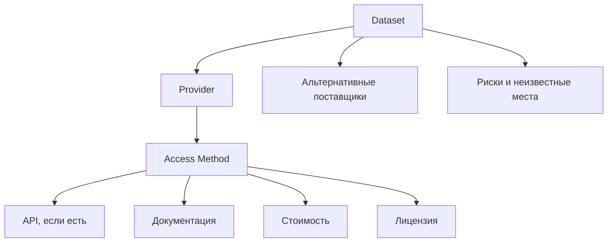

# Dataset -> Provider -> Access Graph

Дата обновления: 2026-06-23
Статус: первичный граф на основе Pass #1 и миграции Pass #2

## Общая модель

## Текущая карта Dataset

```mermaid
flowchart TD
    API_META["Dataset: Метаданные каталога API"]
    COMPANY["Dataset: Реестр компаний и контрагентов"]
    TENDERS["Dataset: Закупки, тендеры и контракты"]
    MOSCOW["Dataset: Открытые городские данные Москвы"]
    ADDRESS["Dataset: Адресный реестр России"]

    APIPORTAL["Provider: API Portal / RNDSOFT"]
    CREDINFORM["Provider: Credinform"]
    SELDON["Provider: Seldon"]
    MOSGOV["Provider: Правительство Москвы"]
    FIAS["Provider: ФИАС / KLADR API, не подтверждено"]

    API_META --> APIPORTAL
    COMPANY --> CREDINFORM
    COMPANY --> SELDON
    TENDERS --> SELDON
    MOSCOW --> MOSGOV
    ADDRESS --> FIAS

    APIPORTAL --> APIPORTAL_WEB["Access: веб-каталог"]
    CREDINFORM --> GLOBAS_API["Access/API: ГЛОБАС.API"]
    SELDON --> SELDON_BASIS["Access/API: API Seldon.Basis"]
    SELDON --> SELDON_TENDERS["Access/API: API Seldon.Tenders"]
    MOSGOV --> MOSCOW_API["Access/API: API Портала открытых данных Москвы"]
    MOSGOV --> MOSCOW_WEB["Access: веб-портал / Open Data"]
    FIAS --> FIAS_API["Access/API: API ФИАС"]

    GLOBAS_API --> GLOBAS_DOC["Документация: страница Глобас"]
    SELDON_BASIS --> SELDON_DOC_RISK["Документация: api-seldon.ru, требует проверки"]
    SELDON_TENDERS --> SELDON_DOC_RISK
    MOSCOW_API --> MOSCOW_DOC_RISK["Документация: data.mos.ru, была недоступна при проверке"]
    FIAS_API --> FIAS_DOC_RISK["Документация: kladr-api.ru, требует проверки"]

    GLOBAS_API --> GLOBAS_COST["Стоимость: по запросу"]
    SELDON_BASIS --> SELDON_COST["Стоимость: от 1 000 руб. по API Portal"]
    SELDON_TENDERS --> SELDON_COST
    MOSCOW_API --> MOSCOW_COST["Стоимость: бесплатно по API Portal"]
    FIAS_API --> FIAS_COST["Стоимость: по запросу"]

    GLOBAS_API --> LIC_UNKNOWN["Лицензия: неизвестно"]
    SELDON_BASIS --> LIC_UNKNOWN
    SELDON_TENDERS --> LIC_UNKNOWN
    MOSCOW_API --> LIC_MOSCOW_UNKNOWN["Лицензия открытых данных: требует проверки"]
    FIAS_API --> LIC_UNKNOWN

    COMPANY --> COMPANY_ALT["Альтернативы: SpectrumData, Актион, Репутация указаны как направления TODO, не исследованы"]
    TENDERS --> TENDERS_ALT["Альтернативы: не найдены"]
    MOSCOW --> MOSCOW_ALT["Альтернативы: другие гос. open data порталы, не исследованы"]
    ADDRESS --> ADDRESS_ALT["Альтернативы: официальный ФИАС требует исследования"]
    API_META --> API_META_ALT["Альтернативы: другие API-каталоги, не исследованы"]
```

## Dataset-level связи

| Dataset | Provider | Access/API | Документация | Стоимость | Лицензия | Альтернативы |
|---|---|---|---|---|---|---|
| Метаданные каталога API | API Portal / RNDSOFT | веб-каталог | не найдена | просмотр бесплатен | неизвестно | другие каталоги API не исследованы |
| Реестр компаний и контрагентов | Credinform | ГЛОБАС.API | страница Глобас | по запросу | неизвестно | Seldon; другие поставщики в TODO |
| Реестр компаний и контрагентов | Seldon | API Seldon.Basis | `api-seldon.ru`, требует проверки | от 1 000 руб. по API Portal | неизвестно | Credinform; другие поставщики в TODO |
| Закупки, тендеры и контракты | Seldon | API Seldon.Tenders | `api-seldon.ru`, требует проверки | от 1 000 руб. по API Portal | неизвестно | не найдены |
| Открытые городские данные Москвы | Правительство Москвы | API и веб-портал | `data.mos.ru`, доступность требует проверки | бесплатно по API Portal | неизвестно | другие гос. порталы не исследованы |
| Адресный реестр России | ФИАС / KLADR API, не подтверждено | API ФИАС | `kladr-api.ru`, требует проверки | по запросу | неизвестно | официальный ФИАС требует исследования |

## Главные разрывы графа

- Почти все License-узлы неизвестны.
- Документация Seldon и ФИАС не подтверждена.
- Альтернативные поставщики не исследованы системно.
- Dataset `Открытые городские данные Москвы` должен быть разбит на отдельные наборы.
